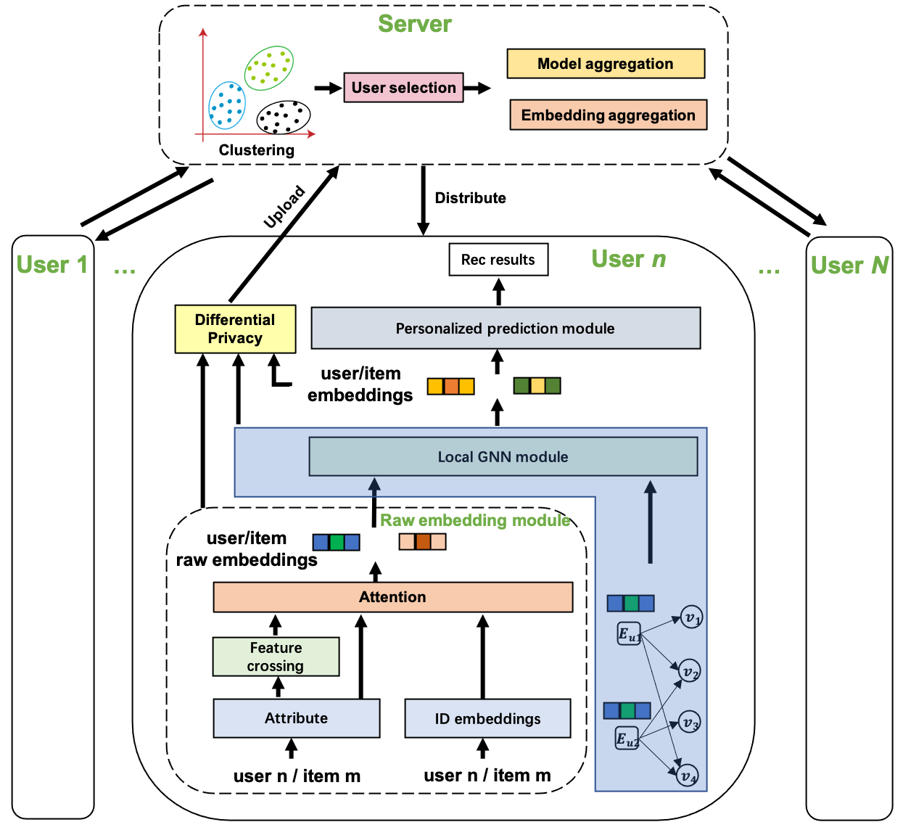

# Personalized Federated Recommendation via Joint Representation Learning, User Clustering, and Model Adaptation


> **Personalized Federated Recommendation via Joint Representation Learning, User Clustering, and Model Adaptation.**  
Sichun Luo, Yuanzhang Xiao, Linqi Song.  
*CIKM2022*

---


This is the PyTorch implementation for the PerFedRec model. Another implementation and an improved version are available at [PerFedRec++](https://github.com/sichunluo/PerFedRec-Plus).


## Introduction
In this paper, we propose a Graph Neural Network based Personalized Federated Recommendation (**PerFedRec**) framework via joint representation learning, user clustering, and model adaptation. Specifically, we construct a collaborative graph and incorporate attribute information to jointly learn the representation through a federated GNN. Based on these learned representations, we cluster users into different user groups and learn personalized models for each cluster. Then each user learns a personalized model by combining the global federated model, the cluster-level federated model, and the user's fine-tuned local model. To alleviate the heavy communication burden,  we intelligently select a few representative users (instead of randomly picked users) from each cluster to participate in training.

<div style="text-align:center">

<\div>

## Train


To train the model in centralized setting:
```
python Central.py
```
To train the model in federated setting:
```
python FedAvg.py
```
To train the model in the paper:
```
python PerFedRec.py
```

## Citation

	@inproceedings{luo2022personalized,
        title={Personalized Federated Recommendation via Joint Representation Learning, User Clustering, and Model Adaptation},
        author={Luo, Sichun and Xiao, Yuanzhang and Song, Linqi},
        booktitle={Proceedings of the 31st ACM International Conference on Information \& Knowledge Management},
        pages={4289--4293},
        year={2022}
    }
    


